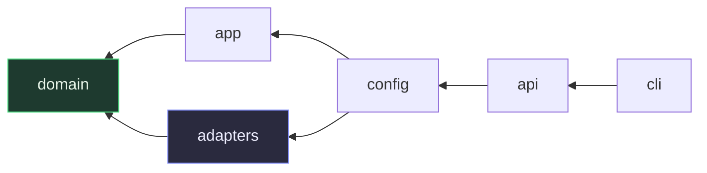
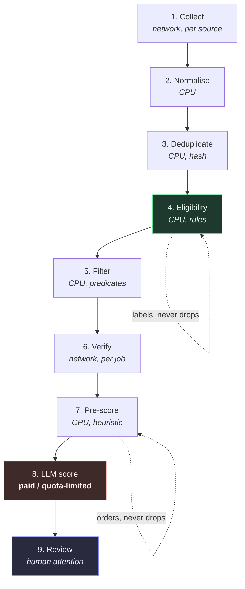
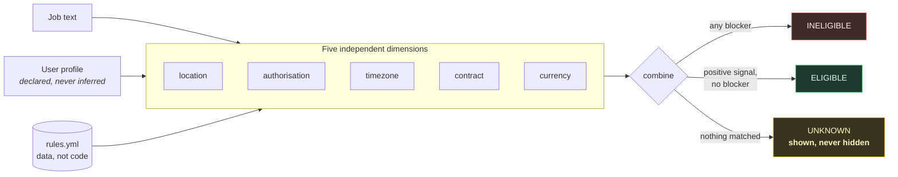
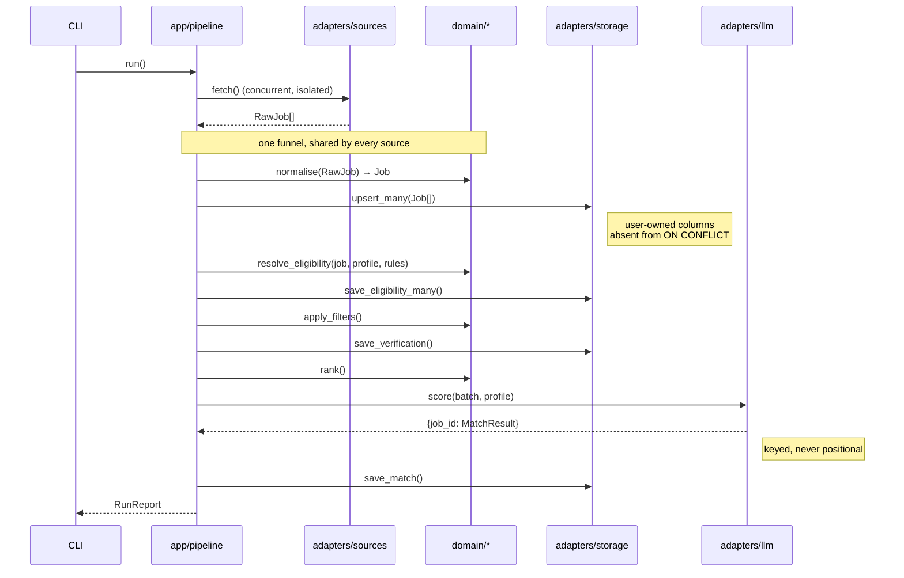

# Architecture

How Outpost fits together, and why it is shaped this way.

The reasoning behind each decision — including what was rejected and what it
cost — lives in [`docs/adr/`](adr/README.md). This document is the map; the
ADRs are the argument.

---

## 1. The shape

Ports and adapters, with a pure domain core ([ADR-0003](adr/0003-hexagonal-architecture.md)).

```
src/outpost/
├── domain/      pure. no I/O, no env, no clock, no network.
│                models · eligibility · rules · predicates · normalisation
│                filters · ranking · verification · ports
├── adapters/    all I/O. implements the ports the domain declares.
│                sources/ · llm/ · storage/ · http · verifier · profile · clock
├── app/         use-cases. orchestrates domain + ports. no direct I/O.
├── api/         FastAPI. JSON over localhost.
├── cli/         Typer.
└── config/      the composition root. the only place env is read.
```

**Dependencies point inward, always:**



`domain/` imports nothing from `adapters/`, `app/`, `api/`, `cli/` or
`config/`. The domain *declares* the interfaces; adapters implement them.

**This is enforced, not encouraged.** Three `import-linter` contracts run in CI:

| Contract | What it prevents |
|---|---|
| Domain is pure | A network call or a file read sneaking into a decision function |
| Layers point inward | An adapter reaching up into a use-case |
| Only the composition root reads config | `os.getenv` appearing three layers deep |

Without these, layering is a convention that decays quietly between reviews.

---

## 2. The pipeline

Nine stages, ordered by **cost per item, ascending**
([ADR-0005](adr/0005-cost-gated-pipeline.md)). Nothing expensive runs before
everything cheap has run.



Observed on a real run (India profile, 4 sources, no LLM configured):

```
   398 fetched  →  398 unique
        ↓  eligibility
    46 eligible · 289 unknown · 63 ineligible
        ↓  filter   (no_signal 173, ineligible 63, title 29, too_old 22, contract 4)
   107 worth considering
        ↓  verify
   107 checked
        ↓  pre-score
   107 ranked, best first
```

Two properties fall out of the ordering, and both are maintained deliberately
rather than assumed:

**Stage 7 orders, it does not filter.** The pre-score is a cheap local
heuristic whose only job is to sort best-first, so that stage 8 can be
interrupted. Combined with the cap, exhausting a quota costs the user *the tail
of the ranking*, not a random slice.

**Stage 8 degrades, it does not fail.** `QuotaExhausted` is an expected end
state. The run commits what it scored, reports it, and exits zero. The next run
resumes, because scoring only touches rows where `match_score IS NULL` — so
resumability is a property of the query, not of bookkeeping.

---

## 3. Eligibility — the core

The product thesis is that "can this person hold this job?" is a first-class,
explicitly *uncertain* property ([ADR-0002](adr/0002-tri-state-eligibility.md)).



**Every verdict carries its evidence** — the rule id, the matched phrase, and
the field it came from. A verdict that cannot be explained is rejected at the
model level, not merely discouraged:

```python
@model_validator(mode="after")
def _determined_verdicts_carry_evidence(self) -> Self:
    if self.eligibility.is_determined and not (self.rule_id and self.evidence):
        raise ValueError(...)
```

That is what makes a wrong rule *reportable* rather than merely mysterious, and
it is why the UI can render the exact sentence from the listing that produced
the decision.

### Combination precedence

1. Any `INELIGIBLE` dominates — one hard blocker is enough.
2. Otherwise any `ELIGIBLE` wins — positive evidence somewhere, no blocker.
3. `UNKNOWN` only when *no* dimension matched anything at all.

The subtlety is rule 2, and it was got wrong first. The stricter reading — "any
`UNKNOWN` dominates" — was implemented, and made `ELIGIBLE` nearly unreachable:
a listing saying *"work from anywhere"* came back `UNKNOWN` because it said
nothing about currency. See [ADR-0007](adr/0007-eligibility-rules-as-data.md).

---

## 4. Data flow



Two boundaries on that diagram carry most of the system's correctness:

**`normalise()` is the only place looseness becomes strictness.** Sources fetch;
they do not parse ([ADR-0008](adr/0008-source-plugin-contract.md)). Parsing that
lives per-source drifts per-source, and then salaries are read one way by the
RemoteOK adapter and another by Lever, and the bug has eight homes.

**LLM results are keyed by job id, never positional.** Providers omit entries
they cannot score. With a list, one omission shifts every later score onto the
wrong listing — silently, undetectably. See
[ADR-0006](adr/0006-provider-agnostic-llm.md).

---

## 5. Storage

One SQLite file ([ADR-0004](adr/0004-sqlite-explicit-sql.md)), explicit SQL, no
ORM, forward-only migrations keyed on `PRAGMA user_version`.

The load-bearing part is the upsert's conflict clause:

```sql
INSERT INTO jobs (...) VALUES (...)
ON CONFLICT(id) DO UPDATE SET
    title = excluded.title,
    description = excluded.description,
    last_seen_at = excluded.last_seen_at
    -- status, notes and eligibility_override are ABSENT from this list,
    -- deliberately and permanently.
```

**That omission is the guarantee.** A re-scrape refreshes the listing and never
destroys the user's own work. It is covered by a regression test that
shortlists a job, annotates it, overrides its verdict, re-scrapes with changed
content, and asserts all three survive.

Field ownership:

| Class | Fields | Written by |
|---|---|---|
| Source-derived | title, company, description, compensation, tags, dates | every scrape |
| Derived | eligibility, verification, prescore, match | pipeline stages |
| **User-owned** | **status, notes, eligibility_override** | **the user, only** |

---

## 6. Configuration

Read exactly once, at the edge, and passed inward
([ADR-0009](adr/0009-composition-root.md)).

```
env / .env / config.yml
        ↓
   Settings (validated, frozen)
        ↓
   build_container()  ←── the only wiring in the codebase
        ↓
   Container { repository, sources, llm, verifier, clock, ruleset, profile }
        ↓
   pipeline_deps()  ←── hands over ports, never the container itself
```

The container is never passed to a use-case. Use-cases receive the ports they
use; handing the whole container downward would make it a service locator and
re-hide the dependencies this design exists to expose.

Resources — prompts, the default ruleset — resolve against the **package** via
`importlib.resources`, never the working directory. A prompt that silently
degrades because you ran the tool from another folder is a failure mode we
designed out rather than discovered.

---

## 7. What is deliberately absent

| Not here | Why |
|---|---|
| A server | Local-first. There is no Outpost backend to breach ([ADR-0001](adr/0001-local-first-not-hosted.md)) |
| Telemetry | Same. The cost is that we cannot measure anything, and we accept it |
| An ORM | The upsert semantics carry the user-data guarantee and must stay visible |
| A DI framework | Thirty lines of explicit construction beats a DSL at this size |
| Auto-apply | [ADR-0011](adr/0011-no-auto-apply.md). Not behind a flag, not opt-in |
| Authentication | Nothing to authenticate against; bound to loopback, and `doctor` warns if that changes |

---

## 8. Testing

| Layer | Approach |
|---|---|
| `domain/` | Plain function calls. No mocks, no fixtures, no event loop, no database |
| `adapters/sources` | Captured fixtures + `respx`. Every registered source runs one shared contract suite |
| `adapters/llm` | `respx`, injected sleep spy — retry policy is asserted without sleeping |
| `adapters/storage` | A real SQLite database on `tmp_path` |
| `app/pipeline` | Fake ports. Source failure, empty source, quota exhaustion, resumability |
| `api/` | FastAPI `TestClient` against a real temporary database |

No test touches the network. A `live` marker exists for opt-in checks against
real endpoints and is excluded from CI.

Coverage is enforced at 70% overall in CI, and is materially higher on the
parts that matter: `app/pipeline` 100%, `domain/ranking` 100%, `domain/filters`
97%, `adapters/storage` 96%.
